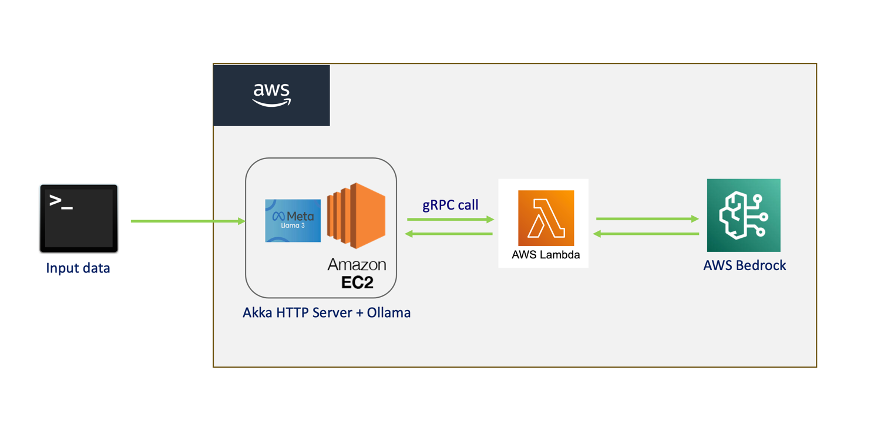

# AWS-Bedrock-Based-LLM-Conversation-API-with-Ollama-Integration

This project demonstrates the integration of AWS Bedrock, Ollama, and AWS Lambda to create a conversational API. The system mimics a chatbot conversation where AWS Bedrock generates text, and Ollama responds accordingly, facilitated through AWS Lambda. The project uses Akka HTTP to handle requests and responses, gRPC for service communication, and AWS API Gateway for managing the API.



## Architecture Overview
- **Client Interface**: The interaction begins with Postman or curl, where a client sends a request.
- **Akka HTTP Server**: An Akka HTTP server listens for incoming requests and routes them to appropriate endpoints.
- **AWS Lambda**: The Akka HTTP server makes a gRPC call to AWS Lambda, which then communicates with AWS Bedrock to generate text.
- **AWS Bedrock**: AWS Bedrock is used for generating responses for the chatbot.
- **Ollama**: After the response from AWS Bedrock, it is passed to Ollama, and Ollama provides further responses to mimic the conversation flow.
- **AWS API Gateway**: It acts as the front-facing service for API requests.

## Project Structure

Project Structure:
```
├── src
│   ├── main
│   │   ├── scala
│   │   │   ├── AkkaHttpServer.scala            # Akka HTTP server for managing requests/responses
│   │   │   ├── Endpoint.scala                 # Defines API endpoints for communication
│   │   │   ├── LambdaInvoker.scala            # Code for invoking AWS Lambda functions for backend processing
│   │   │   ├── OllamaAPIClient.scala          # Defines API to interact with Ollama
│   │   ├── resources
│   │   │   ├── application.conf               # Configuration file for settings like API endpoints, model details, etc.
│   ├── test...
├── target                                     # Compiled files and build output
├── .gitignore                                 # Git ignore file
├── build.sbt                                  # Build configuration file for SBT
└── README.md                                  # Project documentation
```

## Prerequisites
Ensure the following are installed and configured:
- **Scala (version 2.12 or compatible)**
- **Akka HTTP** (for building RESTful API)
- **AWS EC2**
- **AWS Lambda and API Gateway setup** (for invoking Lambda functions)
- **AWS Bedrock** (for text generation via LLM)
- **Ollama setup** (for local LLM model)
- **gRPC** (for interaction between services)
- **SBT** (Scala Build Tool for building the project)
- **Java Development Kit (JDK) 8 or higher**
- **Docker** (for containerized services if needed)

# Steps to Execute the Project

## 1. Clone the Repository

### Clone the GitHub repository to your local machine:
```bash
git clone https://github.com/SunilKuruba/AWS-Bedrock-Based-LLM-Conversation-API-with-Ollama-Integration.git
```

### Navigate to the project directory:
```bash
cd <project-directory>
```

---

## 2. Set Up EC2 Instance

1. Launch an AWS EC2 instance with the necessary specifications for running a Scala application.
2. Install the following on the instance:
   - Java (JDK 8 or higher)
   - SBT (Scala Build Tool)
   - Any required dependencies.
3. Deploy the Scala application containing the Akka HTTP server to the EC2 instance.

---

## 3. Configure AWS API Gateway

1. Set up an AWS API Gateway to expose RESTful endpoints.
2. Create and configure API routes to invoke the AWS Lambda function.
3. Note down the generated API endpoint URLs for later use.

---

## 4. Set Up AWS Lambda

1. Create a Lambda function in AWS and upload the Python code located in:
   ```bash
   src/main/aws/lambda.py
   ```
2. Ensure that the Lambda function is correctly configured to communicate with AWS Bedrock and Ollama.

---

## 5. Set Up AWS Bedrock

1. Configure AWS Bedrock with the Meta Llama foundation model for text generation.
2. Ensure that the IAM policy for the Bedrock instance has the necessary permissions to interact with the Lambda function.

---

## 6. Configure IAM Policies

Set up an IAM role or policy with permissions for:
- AWS Bedrock access.
- AWS Lambda execution.
- AWS API Gateway 

---

## 7. Install Ollama Locally

1. Download and install Ollama on your local machine.
2. Ensure the Ollama server is configured and running before initiating requests.

---

## 8. Install Postman or Use cURL

- Use **Postman** for a user-friendly interface.
- Alternatively, use **cURL** for CLI-based interactions to send API requests.

---

## 9. Run the Application

1. Use the generated API Gateway endpoint (noted earlier) to send requests to the Akka HTTP server running on the EC2 instance.
2. Once a request is processed, the output will be available in the following directory:
   ```bash
   src/main/resources
   ```

---

## 10. Monitor Results

- Monitor the results in the specified directory.
- Iterate or debug as needed for improvements.
## Testing
To validate the implementation, run the provided test cases locally using SBT:
```
sbt test
```
Ensure that your test environment has the necessary libraries and dependencies installed for successful test execution.

## Example API Request (Postman or curl)
Send a POST request to the API endpoint (/chat) with a JSON payload containing the user's message:

Request:
```
{
"message": "Hello, how are you?"
}
```
Response:
```
{
"response": "I'm doing great, thank you for asking! How can I assist you today?"
}
```